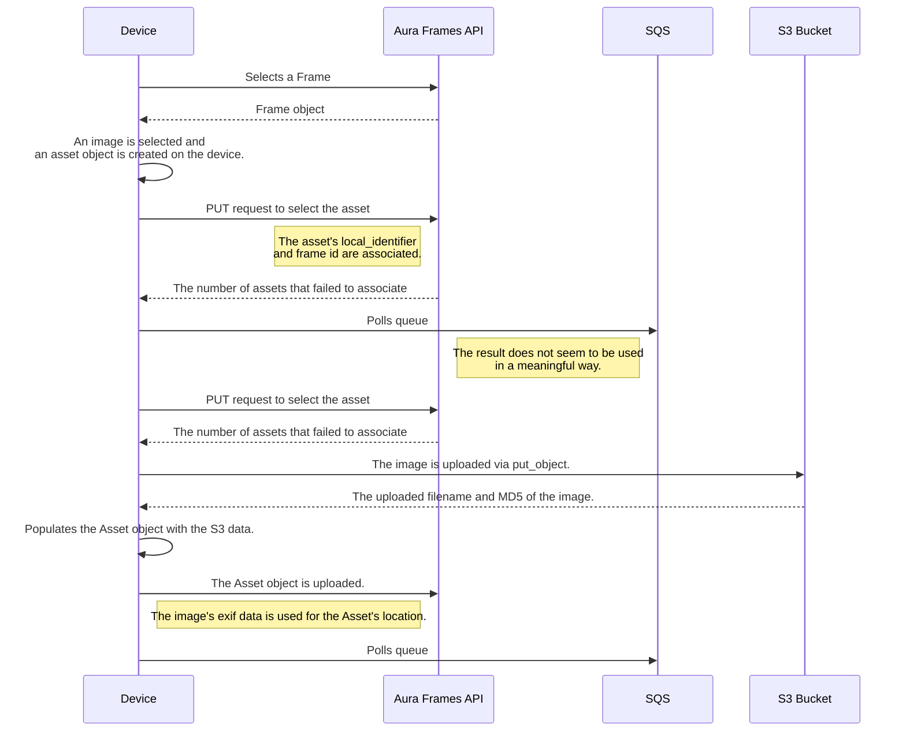

# Aura Frames Python Client [unofficial]

An unofficial Python client for the Aura Frames (PUSHD) API. This library reverse-engineers the mobile app's API interactions for programmatic photo frame management.

## Features

- **Async API client** with HTTP/2 support
- **TUI application** for interactive album captioning
- **Bulk image download** with EXIF metadata preservation
- **Frame data export** to JSON
- **AWS S3/SQS integration** for image uploads
- **Retry logic** with exponential backoff
- **Type-safe configuration** via Pydantic Settings
- **Full type annotations** with mypy support

## Installation

```bash
# Clone the repository
git clone https://github.com/your-username/auraframes.git
cd auraframes

# Using uv (recommended)
uv sync

# Or with pip
pip install -e .

# Install development dependencies
uv sync --group dev
```

## Configuration

### Environment Variables

| Variable | Required | Default | Description |
|----------|----------|---------|-------------|
| `AURA_EMAIL` | Yes | - | Account email for authentication |
| `AURA_PASSWORD` | Yes | - | Account password for authentication |
| `AURA_DEBUG` | No | `false` | Enable debug logging |
| `AURA_LOCALE` | No | `en-US` | Device locale to emulate |
| `AURA_DEVICE_IDENTIFIER` | No | `0000000000000000` | Device ID to emulate |
| `AURA_APP_IDENTIFIER` | No | `com.pushd.client` | App identifier |
| `AURA_IMAGE_PROXY_URL` | No | `https://imgproxy.pushd.com` | Image proxy base URL |
| `AWS_UPLOAD_IDENTITY_POOL_ID` | No* | - | Cognito Identity Pool for S3 uploads |
| `AWS_SQS_IDENTITY_POOL_ID` | No* | - | Cognito Identity Pool for SQS |

\* Required only for upload functionality

### .env File Support

Copy the example file and fill in your values:

```bash
cp .env.example .env
```

See [`.env.example`](.env.example) for all available options.

## Quick Start

### Python API

```python
import asyncio
from auraframes import Aura

async def main():
    async with Aura() as aura:
        await aura.login()

        # List all frames
        frames = await aura.frame_api.get_frames()
        for frame in frames:
            print(f"{frame.name}: {frame.num_assets} photos")

asyncio.run(main())
```

### TUI Application

Launch the interactive terminal UI for album captioning:

```bash
python -m auraframes.tui
```

## Usage Examples

### Download All Images from a Frame

```python
import asyncio
from auraframes import Aura

async def download_frame_images():
    async with Aura() as aura:
        await aura.login()

        frames = await aura.frame_api.get_frames()
        frame = frames[0]

        # Download with EXIF metadata
        await aura.dump_frame(
            frame_id=frame.id,
            path="./exports",
            download_images=True,
            download_activities=True
        )

asyncio.run(download_frame_images())
```

### Add Captions to an Album

```python
import asyncio
from auraframes import Aura

async def caption_album():
    async with Aura() as aura:
        await aura.login()

        frames = await aura.frame_api.get_frames()
        frame = frames[0]

        # Get playlists (albums)
        playlist_id = frame.playlists[0]["id"]

        # Add caption to all photos in album
        count = await aura.caption_album(
            frame_id=frame.id,
            playlist_id=playlist_id,
            caption="Summer Vacation 2024",
            include_date=True  # Appends "(Month Year)" to caption
        )
        print(f"Captioned {count} photos")

asyncio.run(caption_album())
```

### Export Frame Data

```python
import asyncio
from auraframes import Aura

async def export_data():
    async with Aura() as aura:
        await aura.login()

        frames = await aura.frame_api.get_frames()
        frame_id = frames[0].id

        # Get all assets with pagination
        assets = await aura.get_all_assets(frame_id)
        print(f"Found {len(assets)} assets")

        # Get activities
        activities, _ = await aura.frame_api.get_activities(frame_id)
        print(f"Found {len(activities)} activities")

asyncio.run(export_data())
```

## API Reference

### Aura Class

The main orchestrator providing high-level operations:

```python
class Aura:
    # API clients
    account_api: AccountApi      # Authentication
    frame_api: FrameApi          # Frame management
    asset_api: AssetApi          # Asset operations
    activity_api: ActivityApi    # Activity feed
    playlist_api: PlaylistApi    # Album/playlist management
    attachment_api: AttachmentApi  # Captions and attachments

    # High-level methods
    async def login(email=None, password=None) -> Aura
    async def get_all_assets(frame_id: str) -> list[Asset]
    async def dump_frame(frame_id, path, ...) -> None
    async def download_images_from_assets(assets, path, ...) -> list[Asset]
    async def caption_album(frame_id, playlist_id, caption, ...) -> int
```

### Models

- `Frame` - Photo frame with playlists and settings
- `Asset` - Image/video with metadata and URLs
- `User` - User account information
- `Activity` - Feed activity entry

## Architecture

### Image Upload Flow

The upload process follows the mobile app's sequence:



### Image Download Flow

1. Frame data is retrieved from `/frames/<frame_id>.json`
2. Paginated asset list is fetched from `/frames/{frame_id}/assets.json`
3. Image URL is constructed: `{IMAGE_PROXY_URL}/{user_id}/{filename}`
4. EXIF metadata (location, timestamps) is written to downloaded images

### Project Structure

```
auraframes/
├── api/              # API client modules
│   ├── account_api.py
│   ├── asset_api.py
│   ├── frame_api.py
│   └── ...
├── aws/              # AWS integrations
│   ├── aws_client.py # Base Cognito client
│   ├── s3_client.py  # S3 upload client
│   └── sqs_client.py # SQS polling client
├── models/           # Pydantic models
├── services/         # Business logic
├── utils/            # Utilities
├── client.py         # HTTP client
├── exif.py           # EXIF metadata handling
├── export.py         # Image download/export
└── tui.py            # Terminal UI
```

## Development

### Running Tests

```bash
# Run all tests
uv run pytest

# With coverage
uv run pytest --cov=auraframes

# Specific test file
uv run pytest tests/test_client.py -v
```

### Type Checking

```bash
uv run mypy auraframes/
```

### Code Quality

All 125 tests passing, mypy clean with full type annotations.

## Known Limitations & TODOs

- [ ] Complete SQS flow mapping (currently used but purpose unclear)
- [ ] Test multiple simultaneous logins for same account
- [ ] Investigate multi-frame asset association (currently re-uploads per frame)
- [ ] Reverse engineer frame device rendering process

## Contributing

Issues and pull requests are welcome. Please ensure tests pass and mypy checks clean before submitting.

## License

This is an unofficial client. Use at your own risk. Not affiliated with Aura Frames.
